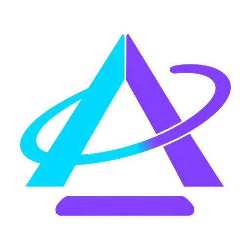
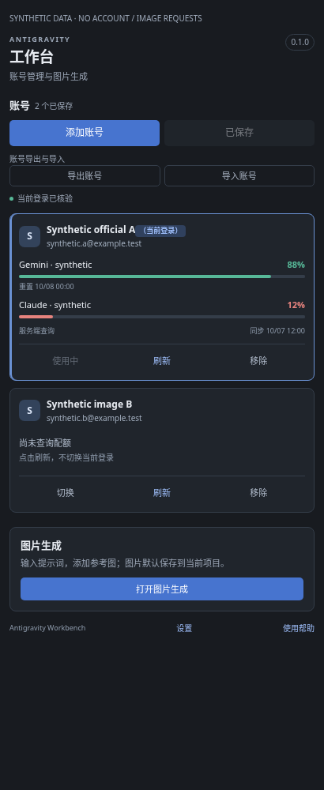
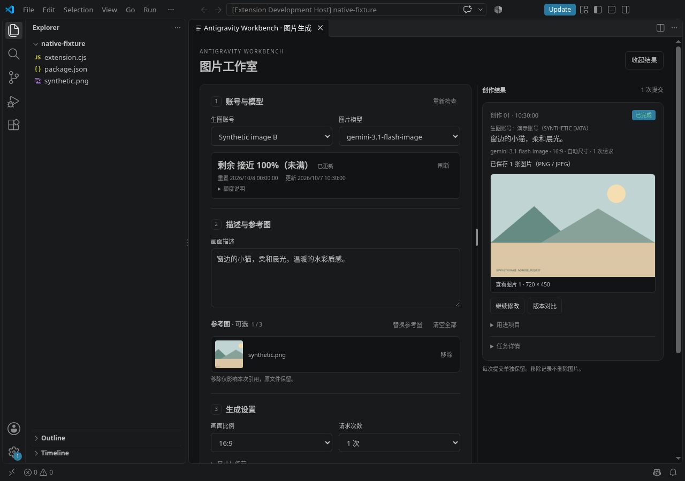
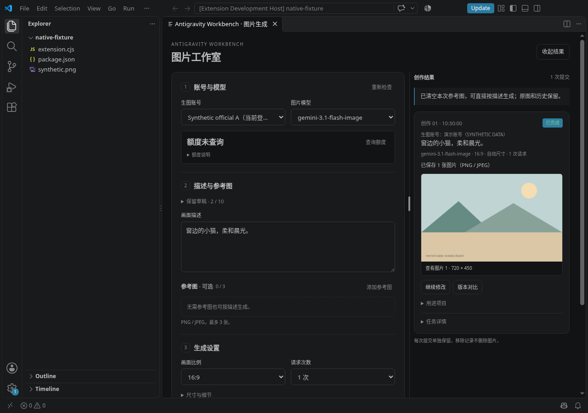

<p align="center">
  
</p>

<h1 align="center">Antigravity Workbench</h1>

<p align="center">在 VS Code 中管理 Google Antigravity 账号、查看额度并创作图片。</p>

<p align="center"><strong>Source-available · Sustainable Use License 1.0</strong></p>

<p align="center">简体中文 · <a href="https://github.com/XiaoXinCodes/antigravity-workbench/blob/main/README_EN.md">English</a></p>

<p align="center">
  <a href="https://marketplace.visualstudio.com/items?itemName=xiaoxincodes.antigravity-account-manager">从扩展市场安装</a> ·
  <a href="https://github.com/XiaoXinCodes/antigravity-workbench/blob/main/docs/README.md">使用文档</a> ·
  <a href="https://github.com/XiaoXinCodes/antigravity-workbench/blob/main/CHANGELOG.md">更新日志</a> ·
  <a href="https://github.com/XiaoXinCodes/antigravity-workbench/issues">提交问题</a>
</p>

Workbench 把多账号管理、服务端额度查询和图片工作室放进同一个 VS Code 工作台。你可以保存或切换账号，也可以为图片任务独立选择已保存账号，再把结果用于当前项目。

本项目独立开发，与 Google 不存在隶属、授权或背书关系。可用模型、权限与额度以所选账号的服务端结果为准。

[快速安装](#快速安装) · [使用步骤](#使用步骤) · [功能演示](#功能演示) · [常见问题](#常见问题) · [参与贡献](#参与贡献)

## 快速安装

**准备：** VS Code 1.95 或更高版本，以及可用的 Google Antigravity 扩展和登录。两个扩展应运行在同一本机或 WSL 宿主。

1. 在 VS Code 扩展面板搜索 **Antigravity Workbench**，核对发布者 **XiaoXinCodes**、扩展 ID `xiaoxincodes.antigravity-account-manager`。
2. 点击 **安装**；也可以打开 [VS Code Marketplace 页面](https://marketplace.visualstudio.com/items?itemName=xiaoxincodes.antigravity-account-manager)，点击 **Install** 在 VS Code 中安装。
3. 按提示重载，在活动栏打开 **Antigravity Workbench**。

**WSL 工作区：** 在连接 WSL 的 VS Code 窗口中，核对 Google Antigravity 的实际运行宿主。官方扩展运行于 WSL 时，在扩展页面选择 **安装到 WSL:〈发行版〉**，将 Workbench 安装到同一远程宿主；官方扩展运行于本机时，两者均保留在本机。

安装与升级不要求清空已有账号、官方登录文件、会话或图片。发行说明、源码和校验文件均在 [最新 Release](https://github.com/XiaoXinCodes/antigravity-workbench/releases/latest)，版本变化见 [更新日志](CHANGELOG.md)。

适配 Windows、macOS、Linux 本机扩展宿主与 WSL Linux 工作区宿主。SSH 和容器宿主尚未核验；三平台自动化检查不代表所有真实账号场景均已验证，详见 [兼容性](docs/COMPATIBILITY.md)。

<details>
<summary>离线备用：从 VSIX 安装</summary>

无法使用扩展市场时，可从 [最新 Release](https://github.com/XiaoXinCodes/antigravity-workbench/releases/latest) 下载 `.vsix` 附件，在目标 VS Code 窗口的命令面板执行 **Extensions: Install from VSIX…**，选择文件并按提示重载。WSL 用户仍需核对实际安装宿主。

</details>

## 可以做什么

| 功能 | 用途 |
| --- | --- |
| 多账号管理 | 浏览器 OAuth 添加账号，保存当前登录，切换已保存账号并自动重启官方组件、核验身份 |
| 服务端额度 | 独立查询每个账号的模型剩余比例、重置时间和更新时间，无需先切换登录 |
| 图片工作室 | 跟随当前登录或独立选择已保存账号；选择其图片模型、提示词、参考图、比例与请求次数，保存和预览 PNG/JPEG |
| 创作记录与版本 | 恢复草稿和任务卡，从已保存结果继续修改、比较版本；保留原图，中断任务不会自动重发 |
| 用进项目 | 复制相对路径或 Markdown；明确点击后插入所示文本文件，不自动保存；复制图片到项目时拒绝覆盖已有文件 |
| 迁移与恢复 | 加密导出、导入账号，恢复已有官方会话 PNG，按需诊断及导出日志 |

## 使用步骤

### 保存或添加账号

1. 已有官方登录时，点击“保存当前账号”。需要添加其他账号时，点击“添加账号”，在浏览器完成 OAuth 授权。添加完成后恢复原登录，使用新账号需另行切换。
2. 需要切换时，在账号卡片点击“切换”，核对确认框列出的后台与本窗口图片任务范围。确认后插件停止所列后台、完成切换、恢复后台并核验身份；相关窗口中的活动任务可能被中断。无法核验后台或登录范围时，显示异常详情与恢复入口。
3. 在账号卡片点击“刷新”，查询该账号的服务端额度，无需先切换登录。

本机保存记录可用时显示不可点击的“已保存”；凭据缺失或不可用时可更新原记录，避免重复添加。保存状态仅表示本机检查通过，不保证服务端授权仍有效。详细流程见 [账号管理](docs/INDEPENDENT_ACCOUNTS.md)。

### 生成图片并用进项目

1. 打开图片工作室，跟随当前登录，或选择另一个已保存账号。等待该账号自己的模型目录返回。
2. 选择模型，填写提示词、比例和请求次数；需要时添加参考图或选择其他输出目录。
3. 点击“生成图片”，核对确认中的账号、模型、请求次数和保存位置后提交。结果默认保存到当前项目，可直接预览。
4. 在已保存结果中继续修改、比较版本，或复制路径、Markdown、图片到项目；插入文本需要明确点击，不自动保存编辑器。

草稿与任务卡保存在当前宿主，重载后恢复。已有图片可从恢复入口找回，无需重新生成。正常使用无需配置请求端点；图片请求失败不会自动重试、切号或切换端点。详见 [图片生成](docs/IMAGE_GENERATION.md) 和 [用进项目](docs/IMAGE_RESULTS.md)。

## 功能演示

截图来自实际 Chromium / VS Code 渲染，使用虚构账号、模拟额度和本地演示图；没有登录真实账号或发送生图请求。截图展示源码中的界面，日常安装与更新请使用扩展市场。

### 账号与额度

添加与保存入口同组显示，当前登录有明确标记。点击对应卡片的“刷新”，查看该账号的剩余比例、重置时间和更新时间。图中账号与百分比均为演示值。



### 图片工作室

选择独立生图账号和它的服务端图片模型，准备提示词、参考图和参数；确认后才提交。右侧保留已保存结果，图片额度百分比不换算成可生成张数。



### 清理参考图与继续创作

参考图可单张移除或全部清空。下图来自实际宿主执行清空后的状态：当前参考图已清空，原图和已保存结果保留，仍可从结果继续修改。



## 界面语言

默认使用简体中文。点击工作台“设置 / Settings”，或在 VS Code 设置中搜索 `antigravityAccounts.language`，手动选择 `zh-CN` 或 `en`。已打开的工作台、图片面板、提示和快速入门立即更新，保留输入、参考图、账号选择、布局与任务。查看 [英文版演示](README_EN.md#feature-walkthrough)。

命令面板、视图标题和设置描述属于静态贡献项，遵循 VS Code 显示语言；更改 VS Code 显示语言可能需要重载。插件的手动语言选择不改变这些静态项。

## 常见问题

| 问题 | 回答 |
| --- | --- |
| 为什么“已保存”不能再点？ | 当前已核验身份已有可用本机副本，无需重复保存；这不保证服务端授权有效。 |
| 为什么某个图片模型没有列出？ | 列表来自所选账号的服务端目录。可以重新检查，但模型名称或订阅名称不保证目录中存在或可调用。见 [目录排查](docs/TROUBLESHOOTING.md#图片模型目录与-pro-排查)。 |
| 额度百分比能换算成图片张数吗？ | 不能。它是所选模型的服务端剩余比例，旧结果会标记；请求次数也不保证产出张数。 |
| 选择另一生图账号会切换官方登录吗？ | 不会。图片页独立选择只影响该图片任务，确认时固定所选账号与模型。 |
| 切换不可用或 WSL 找不到账号怎么办？ | 先核对两个扩展的宿主和是否有待恢复操作；按界面恢复提示处理。保存位置按宿主独立。见 [故障排查](docs/TROUBLESHOOTING.md)。 |
| 重载后会自动继续生图吗？ | 不会。草稿与任务卡会恢复，中断任务保留状态，重新提交需你明确操作。 |
| 如何安装和更新？ | 在 VS Code 扩展面板搜索 Antigravity Workbench，核对发布者 XiaoXinCodes 和扩展 ID `xiaoxincodes.antigravity-account-manager`，点击安装；也可打开 [Marketplace 页面](https://marketplace.visualstudio.com/items?itemName=xiaoxincodes.antigravity-account-manager)。后续在扩展面板更新，无需手动下载 VSIX。 |
| 为什么市场页面的介绍与仓库 README 不同？ | Marketplace 介绍随上传的 VSIX 更新；提交仓库 README 不会自动更新市场介绍。 |

## 隐私与使用边界

账号凭据存放在 VS Code SecretStorage 或当前宿主的受限存储中；账号导出使用 `.agwenc` 加密格式。草稿、参考图路径和任务记录保存在当前宿主，图片写入所选目录。日志与账号导出包不会自动上传。

生成时，所选账号的授权、提示词和选定参考图会发给相应 Google 服务；请只提交你有权使用的内容。切换账号会写入官方组件的本机凭据并重启组件；遇到未完成事务或身份核验失败，应按恢复提示操作。模型是否可用、能否调用及额度含义以服务端结果为准。

## 文档与反馈

| 你要了解 | 文档 |
| --- | --- |
| 完整使用流程 | [快速入门](docs/GETTING_STARTED.md) · [文档目录](docs/README.md) |
| 账号、切换与迁移 | [账号管理](docs/INDEPENDENT_ACCOUNTS.md) · [切换与恢复](docs/ACCOUNT_SWITCHING.md) · [加密迁移](docs/ACCOUNT_MIGRATION.md) |
| 图片与项目操作 | [图片生成](docs/IMAGE_GENERATION.md) · [额度说明](docs/IMAGE_QUOTA.md) · [继续创作与用进项目](docs/IMAGE_RESULTS.md) |
| 排障与支持范围 | [故障排查](docs/TROUBLESHOOTING.md) · [日志说明](docs/DEBUG_LOGS.md) · [兼容性](docs/COMPATIBILITY.md) |
| 版本与使用条件 | [更新日志](CHANGELOG.md) · [项目与服务说明](docs/PROJECT_NOTICES.md) |

反馈问题时，在 [Issues](https://github.com/XiaoXinCodes/antigravity-workbench/issues) 提供扩展版本、系统与宿主、最少复现步骤、预期结果和错误码。需要日志时，从命令面板打开“Antigravity Workbench: 高级排障…”，开启调试，复现必要的一次操作后关闭，再预览和导出。

不要提交 token、凭据文件、账号导出包、私人提示词或未经检查的原始日志。疑似安全漏洞请按 [安全报告流程](SECURITY.md) 私下报告。

## 参与贡献

欢迎文档改进、问题复现、功能建议与 Pull Request。较大改动请先在 [Issues](https://github.com/XiaoXinCodes/antigravity-workbench/issues) 讨论，再按 [贡献指南](CONTRIBUTING.md) 准备提交；只贡献你有权提供的内容，保留第三方许可与来源。

开发使用 Node.js 20+，CI 使用 Node.js 22。源码包含 TypeScript、测试、构建脚本和锁文件，无运行时 npm 依赖。

```sh
npm ci --ignore-scripts
npm run check
npm run test:host
npm run package
```

无显示器的 Linux 使用 `xvfb-run -a npm run test:host`。CI 覆盖 Linux、Windows、macOS 的检查、隔离 VS Code 宿主和打包；默认检查使用合成数据，不要求真实 Google 登录或生图。

## 许可

项目自有部分采用 [Sustainable Use License 1.0](LICENSE)，属于 source-available（源码可见）许可，不是 OSI 标准开源许可。

允许个人、非商业及自身内部商业用途的使用和修改；向他人分发或提供软件必须免费且用于非商业目的。超出正文许可范围的用途，需要向权利人另行取得授权。收费咨询或支持本身并非一概禁止，但软件的使用、分发和提供仍须满足正文条件。这段摘要不增加或替代 [LICENSE](LICENSE) 的条款。

实际随包的第三方代码保留独立许可，见 [第三方声明](THIRD_PARTY_NOTICES.txt)。该许可不授予 Google 服务访问权，也不覆盖第三方代码、素材或商标的权利，详见 [项目与服务说明](docs/PROJECT_NOTICES.md)。
