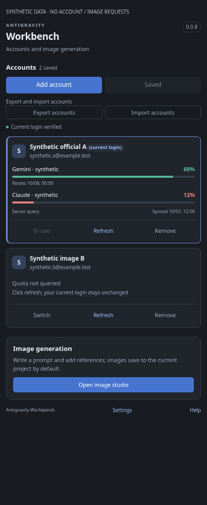
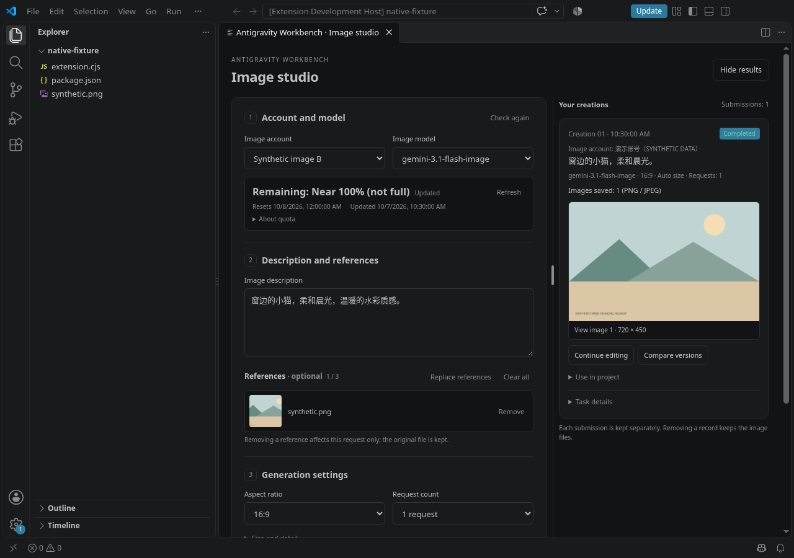
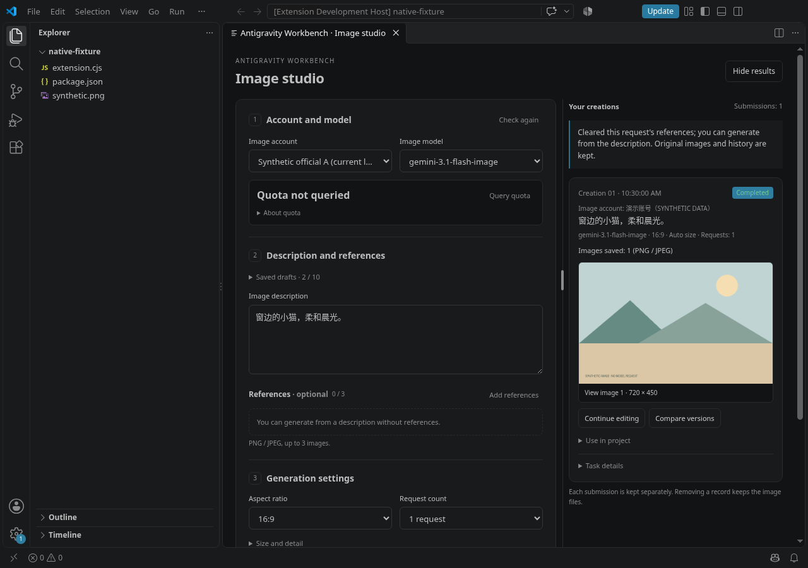

<p align="center">
  
</p>

<h1 align="center">Antigravity Workbench</h1>

<p align="center">Manage multiple Google Antigravity accounts and generate images in VS Code.</p>

<p align="center"><strong>Source-available · Sustainable Use License 1.0</strong></p>

<p align="center"><a href="README.md">简体中文</a> · English</p>

<p align="center">
  <a href="https://github.com/XiaoXinCodes/antigravity-workbench/releases/latest">Download and install</a> ·
  <a href="docs/GETTING_STARTED.en.md">Getting started</a> ·
  <a href="https://github.com/XiaoXinCodes/antigravity-workbench/issues">Report an issue</a>
</p>

## Features

| Feature | Purpose |
| --- | --- |
| Multiple accounts | Add and save accounts through browser OAuth. Switch to a saved account, restart the official component automatically, and verify its identity before reporting completion. |
| Server quota | View model quota, reset times and query status for each account without switching the current login. |
| Image generation | Follow the current login or select a saved account independently. Load image models for that account, select aspect ratio and request count, save and preview PNG/JPEG files, or recover existing PNG files. |
| Creative history | Save drafts, account selection and task cards locally and restore them after reload. Interrupted tasks retain their state and are never automatically resubmitted. |
| Continue editing and compare versions | Put a saved result into an editable draft, preserve its origin and source image, and compare saved versions. |
| Use results in your project | Copy a relative path or Markdown. Insert into the displayed text file only after an explicit click, without automatically saving the file. |
| Account migration and troubleshooting | Export and import accounts. Advanced troubleshooting in the Command Palette provides diagnostics and log export on demand. |

## Requirements

- VS Code 1.95 or later, with an available Google Antigravity extension and login.
- Windows, macOS and Linux local extension hosts, plus WSL Linux workspace hosts. Workbench and Google Antigravity must run on the same side.
- Image models, quota and permissions depend on the Google account selected for the request.

SSH and container extension hosts have not been verified. Platform support and automated checks do not establish that every real-account scenario works. See [compatibility](docs/COMPATIBILITY.md) (Chinese).

## Installation

1. Open the [latest Release](https://github.com/XiaoXinCodes/antigravity-workbench/releases/latest) and download the latest `.vsix` attachment.
2. Run **Extensions: Install from VSIX…** in the target VS Code window and select the file. With WSL, install into the host where Google Antigravity runs.
3. Reload when prompted and open **Antigravity Workbench** in the activity bar.

Installation does not require clearing saved accounts, login files, official sessions or images. See the [latest release notes](https://github.com/XiaoXinCodes/antigravity-workbench/releases/latest).

## Getting started

**Accounts:** Select **Add account (OAuth login)** and authorize in your browser. Adding saves the new account and restores the original login; select **Switch** on its account card when you want to use it. You can also select **Save current login** beside Add account. A locally usable saved record displays **Saved**; missing or unusable credentials can update the existing record without creating a duplicate. This status describes local storage checks and does not guarantee that server authorization remains valid. Switching verifies the resulting identity automatically. Each account card can query server quota independently.

**Images:** Open the image panel. It follows the current login by default, or you can choose another saved account. The panel checks that account's available models. Enter a prompt, aspect ratio and request count, then confirm generation. Images save to the current project by default, or to another directory you select, and can be previewed directly. Drafts and task cards stay on the current host and return after reload. Use the recovery action to restore existing images without generating them again.

[English quick start](docs/GETTING_STARTED.en.md) · [Account management](docs/INDEPENDENT_ACCOUNTS.md) · [Server quota](docs/INDEPENDENT_ACCOUNT_QUOTA.md) · [Image details](docs/IMAGE_GENERATION.md) · [Documentation index](docs/README.md). Detailed technical guides are currently in Chinese.

Normal generation needs no endpoint configuration. Confirmation fixes the account and model for that request. Failure never automatically retries, changes accounts or changes endpoints. For connection diagnostics, see [advanced troubleshooting](docs/TROUBLESHOOTING.md#高级排障图片端点) (Chinese).

## Feature walkthrough

These screenshots show the current code rendered in actual Chromium / VS Code, using fictional accounts, mock quota and a local demonstration image. No real account login or image-generation request was made. They illustrate the source interface; installable release assets are available from the latest Release.

1. **Manage and save accounts.** Add an account or save the current login from the grouped toolbar. A verified identity with a locally usable saved copy displays a disabled **Saved** button. Account cards identify the current login; local saved status does not guarantee server authorization.
2. **Refresh model quota.** Click **Refresh** on an account card to view its model fractions, reset times and update time without switching logins. The accounts and percentages below are demonstration values.



3. **Prepare an image request.** In the image studio, select an image account, a model from its server catalog, a prompt and request count. Remove references individually or clear all; submission requires confirmation. Image quota belongs to the selected account and model and is never converted to an image count.



4. **Clear references while keeping results.** Select **Remove** beside a reference or **Clear all**. The screenshot below follows the actual host's clear action. The original file and saved result remain available; continue editing a result when needed.



5. **Change language immediately.** Set `antigravityAccounts.language` to `zh-CN` in settings. Existing panels update while retaining input, account selection, references and tasks. See the [same walkthrough in Chinese](README.md#功能演示) for actual localized screenshots. Select `en` to return to English.

## Interface language

The extension defaults to Simplified Chinese and does not follow the system language. Open **Settings / 设置** from the workbench, or search VS Code settings for `antigravityAccounts.language`, then manually select `zh-CN` or `en`. The choice persists in user settings. Open workbench and image panels, messages and the quick start update immediately while retaining drafts, reference images, account selection, layout and tasks.

Command Palette entries, view titles and settings descriptions are static VS Code contributions loaded according to VS Code's display language. Changing that display language may require a window reload. The extension's manual language selection does not change these static entries.

## Privacy and usage boundaries

Account credentials are stored in VS Code SecretStorage or restricted storage on the current host. Account exports use the encrypted `.agwenc` format. Drafts, reference image paths and task records stay on the current host; images are written to your selected directory. Logs and account exports are never automatically uploaded. Generation sends the selected account's authorization, prompt and selected reference images to the relevant Google service. Submit only content you are entitled to use.

Switching accounts writes local credentials for the official component and restarts it. Follow recovery instructions if a transaction remains unfinished or identity verification fails. Do not put tokens, credential files, account export bundles or unchecked logs in issues. Server responses determine model availability, call permissions and quota semantics. A model name does not guarantee access; quota percentages do not indicate a number of images you can generate.

## Troubleshooting and feedback

Open **Antigravity Workbench: Advanced troubleshooting…** from the Command Palette, enable debug logs, reproduce the problem once, then disable logging. Preview the logs before exporting. In [Issues](https://github.com/XiaoXinCodes/antigravity-workbench/issues), include the extension version, operating system and host, reproduction steps, expected result and error codes. Do not attach credential files or account export bundles. The extension does not upload logs automatically. Report suspected vulnerabilities privately through the [security reporting process](SECURITY.md).

[Debug logs](docs/DEBUG_LOGS.md) · [Compatibility and limitations](docs/COMPATIBILITY.md) · [Project and service notices](docs/PROJECT_NOTICES.md). These detailed guides are currently in Chinese.

## Development

The source includes TypeScript, tests, build scripts and a lockfile, with no runtime npm dependencies.

```sh
npm ci --ignore-scripts
npm run check
npm run test:host
npm run package
```

On headless Linux, use `xvfb-run -a npm run test:host`. CI checks, runs an isolated VS Code host and packages the extension on Linux, Windows and macOS. Release attachments include the VSIX, complete source and SHA-256 checksums.

See [CONTRIBUTING.md](CONTRIBUTING.md) for discussion, contribution steps and provenance requirements.

## License

Project-owned material is licensed under the [Sustainable Use License 1.0](LICENSE), a source-available license, not an OSI-standard open-source license.

Use and modification are allowed for personal, non-commercial and your own internal business purposes. Distribution or provision to others must be free of charge and for non-commercial purposes. Uses outside the license require separate permission from the rights holder. Paid consulting or support is not categorically prohibited, but use, distribution and provision of the software must still meet the license conditions. This summary neither adds to nor replaces [LICENSE](LICENSE).

Third-party code shipped with the software retains its own licenses; see [THIRD_PARTY_NOTICES.txt](THIRD_PARTY_NOTICES.txt). This license grants no access to Google services and does not cover rights in third-party code, assets or trademarks. See [project and service notices](docs/PROJECT_NOTICES.md).
